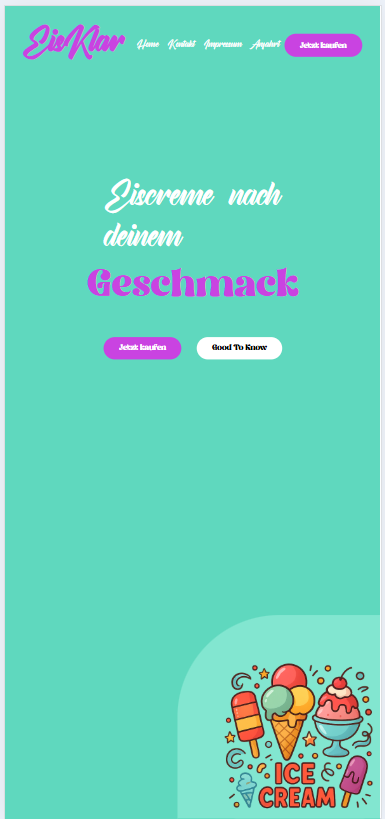
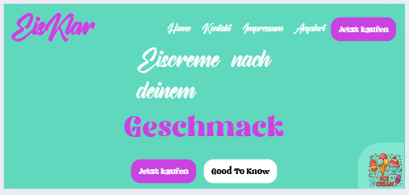

# 🍦 EisKlar 

This project is a website design for selling ice cream. The site features a vibrant and playful design and is currently being developed using HTML and SCSS. 

## Demo

Live demo: [Go and hunt!](https://michelle-bit-web.github.io/ice-cream)

## 🪄 Features

🧭 Navigation Bar:
- Home
- Contact
- Legal Notice (Impressum)
- Directions
- "Buy Now" button - direct access to purchasing ice cream

🖼️ Main Section:
- Large headline
- dynamic desgin elements
- "Buy Now" button
- "Good to Know" button - could be a section / blog area about relevant topics

⚙️ SCSS structure:
- @use is used to import shared variables and mixins
- further files for standard fonts and colors

## 📸 Screenshots

Mobile preview - portrait: 

Mobile preview - landscape: 

## ⚙️ Technologies Used

- HTML
- SCSS

## 🚀 Getting Started

It´s a frontend project, so no installation required. Simply:

1. Clone the repository.
2. Open index.html in your browser.

To view or edit the project in Visual Studio Code:

3. Make sure you have SCSS/Sass support (e.g. Live Sass Compiler extension)

## Project Structure

ice-cream/
├── index.html
├── readme.md
├── style.css
├── style.css.map
├── style.scss
├── assets/
│   └── (fonts, images)
├── scss/
│   └── (scss/_company-colors, scss/_fonts)

## 🤝 Contributing

Ideas and feedback are welcome! Feel free to open issues or submit pull requests.

##💡Planned Extensions

- [ ] 📍 Detailed Contact and Directions sections.

- [ ] 🅱️ A "Good To Know" section or blog.

- [ ] ⚖️ A separate Legal Notice (Impressum) page in a new HTML file

- [ ] 💡 Improve game logic.
   
## 🤓 Author

Created by [Michelle Puschkarow].
If you like this project, feel free to give it a ⭐️ or contribute!

